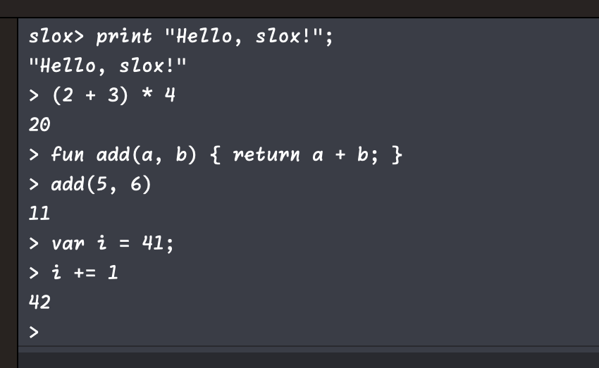

# Purpose

I've had the book, "Crafting Interpreters", for a while and went through the first section of it a couple of years ago, following the Java code to build an implementation of the Lox language... but unfortunately it didn't really stick with me. That's not the author's fault but mine; just copying and pasting code wasn't sufficiently effective, as I don't think doing so made me think enough about what I was writing. Moreover, lately I've been looking for a new project to whet my appetite to learn something new, and so I decided to implement Lox in Swift this time. This made me think a lot more about design decisions, and I tried doing things idiomatically in Swift rather than simply transliterate Java code into it. 

# Quick start

Checkout the project using git. Then open it up using Xcode and run the project by hitting ⌘-R. That should start up a REPL within Xcode itself, in the bottom right of the IDE. You should be able to enter expressions and see their effects/results in the REPL.



# Building and installing

At the top of the project directory, type the following in your terminal:

```
xcodebuild install
```

That will create a directory structure in `/tmp/slox.dst` that mimics the actual target directory, in this case `/usr/local/bin`, where the command line executable will ultimately be installed.

Next, run this command:

```
productbuild --root /tmp/slox.dst / slox.pkg
```

That will create a package at the root of the project directory which you can then double-click on to start the installer. Click through all the steps, and the binary should be installed successfully.

# Usage

Once you have installed the executable, you should then be able to start the REPL by entering `slox` in your terminal. Alternatively, you can first edit a file with Lox code, say `foo.lox`, and then run it in the command line by typing `slox foo.lox`.

# Features

This implementation of Lox has quite a few features that the canonical language does not include. So far, the following have been implemented:

### Types

There are four scalar types

* int
* double
* boolean, whose two possible values are `true` and `false`
* string

Additionally, `nil` indicates the lack of a value.

### Expressions

There are several types of operators supported in the construction of expressions:

* arithmetic: `+`, `-`, `*`, `/`, and `%`
* logical: `and`, and `or`
* equality: `==` and `!=`
* comparison: `>`, `>=`, `<`, and `<=`

Subexpressions can also be grouped together using parentheses:

```
(-2) * (3 + 4)
```

### Statements

In slox, statements do not produce a value and instead when executed have some effect on the environment. Multiple statements can be submitted in the REPL in sequence, and need to be separated by semicolons. When running in the REPL, if the last statement in an expression statement, then the value of that associated expression is printed.

Lox also has a builtin `print` statement which, for the time being, takes a single expression:

```
print "Hello, world!";
```

### Variables

Variables are declared with the `var` keyword, and assigned with the `=` operator:

```
var answer;
answer = 42;
```

... or they can be declared and assigned in one fell swoop:

```
var answer = 42;
```

There are also four so-called compound assignment operators, `+=`, `-=`, `*=`, and `/=`, which add, subtract, multiply, and divide, respectively, the variable on the left hand side by the value on the right hand side:

```
var x = 21;
x *= 2;
```

### Flow control

There are three types of flow control statements in slox: `if` blocks:

```
if (x == 42) {
    print "YES!";
} else {
    print "nope";
}
```

... `while` loops:

```
var i = 0;
while (i < 3) {
    print i;
    i = i + 1;
}
```

... and `for` loops

```
for (var i = 0; i < 3; i = i + 1) {
    print i;
}
```

Additionally, users can `break` out of a loop:

```
var i = 0;
while (true) {
    print i;
    if (i > 2) {
        break;
    }
    i = i + 1;
}
```

... or `continue` onto another iteration of a loop:

```
var sum = 0;
for (var i = 1; i < 5; i = i + 1) {
    if (i == 3) {
        continue;
    }
}
print sum;
```

### Collections

Currently, there are two collection types supported in slox: lists and dictionaries. List literals are created using square brackets, and there are native properties and functions for them:

```
var foo = [1, 2, 3];
foo.count;             // Prints 3

foo.append(4);
foo;                   // Prints [1, 2, 3, 4]

foo.deleteAt(2);
foo;                   // Prints [1, 2, 4]
```

Lists also have some methods found typically in functional programming languages, such as `map`:

```
var foo = [1, 2, 3, 4, 5];
foo.map(fun(n) { return n*n; })                // Prints [1, 4, 9, 16, 25]
```

... and `filter`:

```
var foo = [1, 2, 3, 4, 5];
foo.filter(fun(n) { return n<=3; })            // Prints [1, 2, 3]
```

... and finally `reduce`:

```
var foo = [1, 2, 3, 4, 5];
foo.reduce(0, fun(acc, n) { return acc+n; })   // Prints 15
```

Dictionary literals are also created with square brackets, but also use the color character to delimit keys from values. Likewise, dictionaries also have some built-in properties and methods:

```
var bar = ["a": 1, "b": 2];
bar.count              // Prints 2

bar["b"] = 3;
bar;                   // Prints ["a": 1, "b": 3]

bar.keys;              // Prints ["a", "b"]
bar.values;            // Prints ["1", "3"]

bar.merge(["b": 2, "c": 3])
bar;                   // Prints ["a": 1, "b": 2, "c": 3]

bar.removeValue("a")   // Prints 1
```

### Functions

Functions are declared with a preceding `fun` keyword, require an explicit `return` statement to return a value, and are invoked using parentheses:

```
fun add(a, b) {
    return a + b;
}

add(1, 2)
``` 

You can also create and invoke nameless functions or lambda expressions:

```
fun (a, b) { return a + b; }(1, 2)
```

Functions can also take a _single trailing_ variadic parameter, designated with a preceding asterisk. Inside the body of such a function, the parameter is handled like a list:

```
fun sum(*nums) {
    return nums.reduce(0, fun(acc, num) { return acc + num; });
}
sum(1, 2, 3);          // Prints 6
sum(1, 2, 3, 4, 5);    // Prints 15
```

You can also splat a list value, again with an asterisk, into either a function parameter list:

```
fun sum(a, b, c) {
    return a + b + c;
}
var nums = [1, 2, 3]
sum(*nums).            // Prints 6
```

... or a list literal:

```
[*nums, 4, 5, 6]       // Prints [1, 2, 3, 4, 5, 6]
```

### Classes

As with many other programming languages, classes in slox are declared with a preceding `class` keyword, with the class body contained between two braces, and instantiated with parentheses like functions.

```
class Person {}
var me = Person();
```

Properties can be created dynamically _after_ class instantiation:

```
class Person {}
var me = Person();
me.name = "Danielle";
```

Classes can have methods, which do _not_ require the `fun` keyword, and can refer to instance properties via `this`:

```
class Person {
    greet() {
        print "My name is " + this.name;
    }
}
var me = Person();
me.name = "Danielle";
me.greet();
```

Classes can be declared with an `init` method to set properties upon instantiation.

```
class Person {
    init(name) {
        this.name = name
    }
}
var me = Person("Danielle");
```

Classes can also have static methods, which are denoted as such with the `class` keyword:

```
class Math {
    class add(a, b) {
        return a + b;
    }
}
Math.add(1, 2)
```

You can also define computed properties in classes, which look just like functions but do not have an argument list nor parentheses:

```
class Circle {
    init(radius) {
        this.radius = radius;
    }

    area {
        return 3.14159 * this.radius * this.radius;
    }
}
var c = Circle(4);
c.area
```

slox supports single inheritance, using the `<` operator to denote subclassing. You can also invoke superclass methods via `super`, and override methods on a superclass:

```
class BankAccount {
    init(amount) {
        this.balance = amount;
    }
    
    withdraw(amount) {
        if (this.balance >= amount) {
            this.balance -= amount;
            return;
        }
        
        print "Insufficient funds!";
    }
}

class SavingsAccount < BankAccount {
    init(amount) {
        super.init(amount);
    }

    withdraw(amount) {
        if ((this.balance - amount) > 100) {
            this.balance -= amount;
            return;
        }

        print "Insufficient funds!";
    }
}

var ba = BankAccount(199);
ba.withdraw(100);
print ba.balance;

var sa = SavingsAccount(199);
sa.withdraw(100);
```

# Design

Most of the design of slox is fairly similar to the one in the book. There are four phases involved in the execution of code in slox:

- scanning for tokens
- parsing of tokens into statements and expressions
- resolving of variables from parsed code
- interpreting of resolved statements 

However, unlike how they are implemented in the book, the REPL and file runner instantiate just the interpreter, passing in code to be executed; it is the interpreter that instantiates and runs the scanner, parser, resolver in succession, each feeding their results to the next. There are a few other differences between this implementation and that in the book which are described below.

### Enums instead of class hierarchies

Instead of using a class hierarchy to represent statements and expressions, I decided to use enums instead. I found it _significantly_ easier to implement and understand the resolver and interpreter, rather than having to use the visitor pattern. (I have to admit that I am not a very good object-oriented programmer.) Plus, I didn't have to write code to generate all the classes; the Swift enum cases turned out to be much pithier than their Java counterparts, and so were easy to handwrite.

Also, I was able to take advantage of the Swift compiler to ensure that when processing statements and expressions in a `switch` statements, that they were exhaustive and I didn't need to worry about forgetting to handle a case. I would not have gotten the instant feedback of an exhaustivity check if I had used a class hierarchy. (And as far as I know, there is no way to express checking for all possible subclasses for a given class.)

### Management of scope depth

Another choice that I made was to have the resolver consume a set of `Statement`s and `Expression`s and produce a set of `ResolvedStatement`s and `ResolvedExpression`s, some of which possess scope depths for variables. I didn't like having the resolver interact with the interpreter, namely mutating state there, and instead preferred a more functional like approach. This way, the resolver can hand the interpreter the AST, from which it can read the depth values directly from the relevant expression nodes.

Moreover, the Java implementation of the interpreter used a `Map` using the object identity of expression instance as the key. I would have needed to have my `Expresion` enum conform to `Hashable`, and that just seemed weird to me when only two of the cases ever need to used as keys in such a dictionary.

This _does_ invite the possibility of maintenance burden as new statement and expression types are introduced, but at the moment I feel like that risk is minimal, and have clear separation between the resolver and interpreter.

### Error handling

Error handling is done a little differently too. I thought it was a little weird for `Lox` to both kick off processing and then also receive calls from multiple places in the program, as how was implemented in the book. So, instead any of the methods in `Scanner`, `Parser`, `Resolver`, and `Interpreter` can simply throw an error, which then bubbles out to the outermost calling method in `Lox`, and there it is handled. It just seemed easier to understand the system that way.

I also decided to create specialized error enums, one for each phase of processing pipeline, rather than one generalized error class/struct. This gives me a lot more flexibility in the future. Perhaps I may want to catch specific errors and have `slox` do something different for each case; this would be a lot harder to do with just one class/struct.

### Native functions

Instead of maintaining set of native functions in `Interpreter`'s constructor, they reside inside the `NativeFunction` enum. When the interpreter is constructed, it defines each of the native functions enumerated in `NativeFunction`. That keeps the responsibility of `Interpreter` clean and focused.

### Standard library

The interpreter also reads in a small standard library defined in a string. At this point, there are two class declarations for `List` and `Dictionary` classes and some associated methods are defined in each. The hope is that in the future, more things can be added here.

# Unit testing

This repository contains a fairly comprehensive suite of unit tests that exercise the scanner, parser, resolver, and interpreter; to run them, hit ⌘-U from within Xcode.

# Relevant links

- The online version of "Crafting Interpreters"  
  <a href="https://craftinginterpreters.com/contents.html">https://craftinginterpreters.com/contents.html</a>